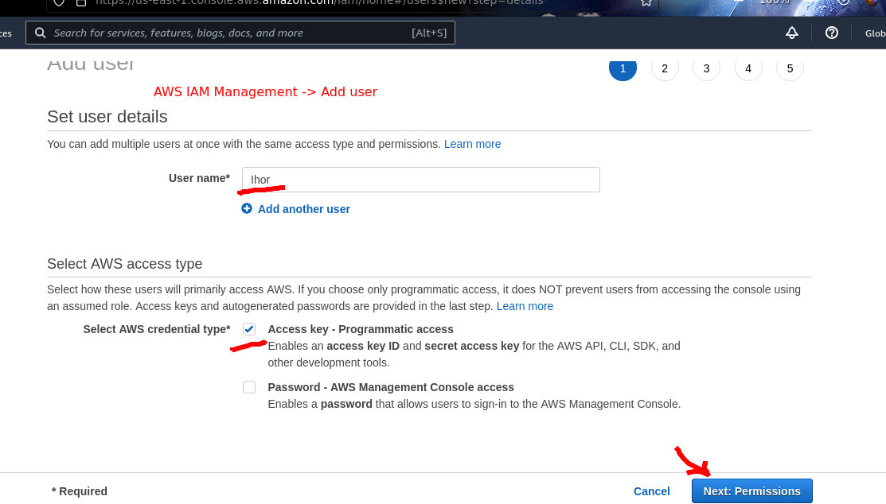
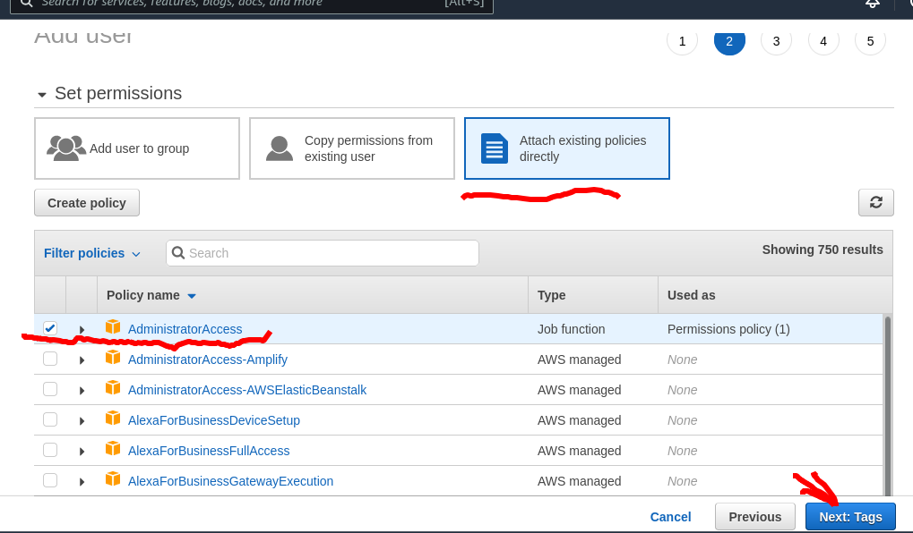
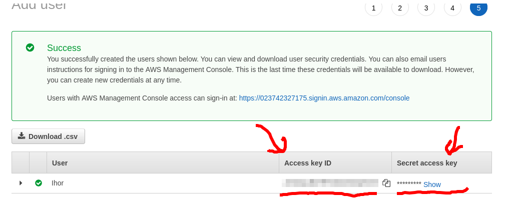
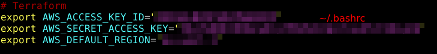
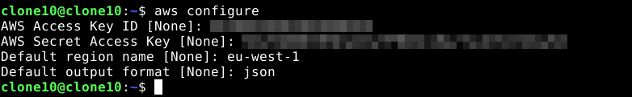
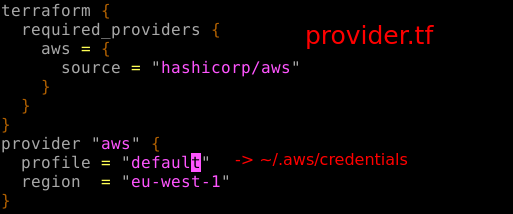

### 1. Install Terraform
```sh
{
    sudo apt-get update && sudo apt-get install -y gnupg software-properties-common curl
    curl -fsSL https://apt.releases.hashicorp.com/gpg | sudo apt-key add -
    sudo apt-add-repository "deb [arch=amd64] https://apt.releases.hashicorp.com $(lsb_release -cs) main"
    sudo apt-get update && sudo apt-get install terraform -y
}
```
### 2. Setup AWS 
### 2.1 Create account




### 2.2 Install aws cli
```sh
{
    curl "https://awscli.amazonaws.com/awscli-exe-linux-x86_64.zip" -o "awscliv2.zip"
    unzip awscliv2.zip
    sudo ./aws/install
}
```
### 2.3 Configure aws cli


### 
